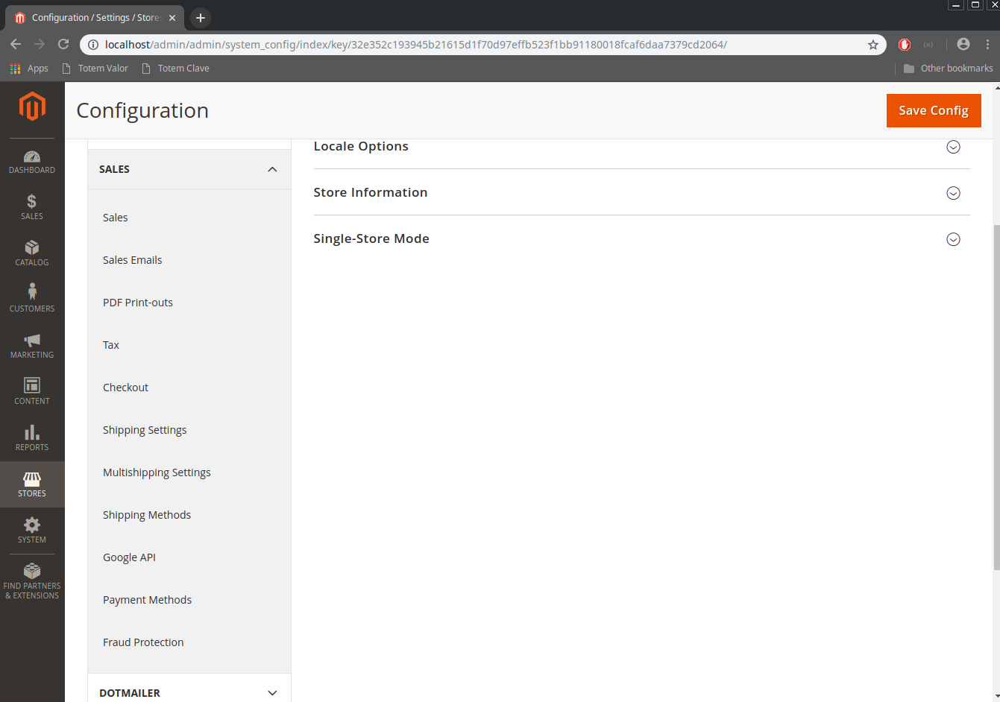
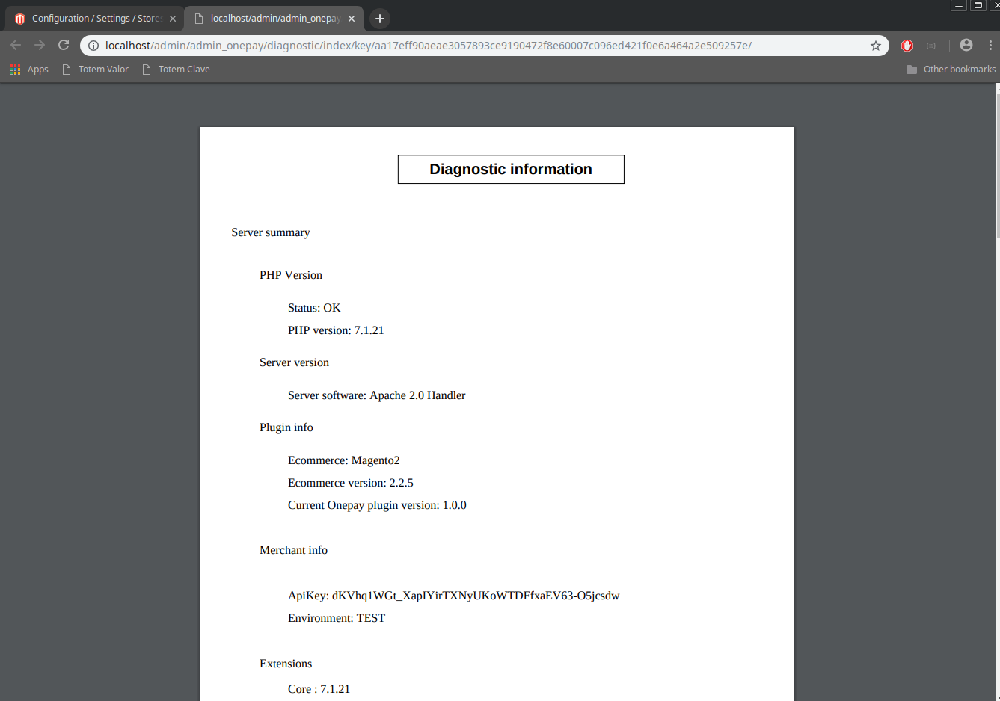
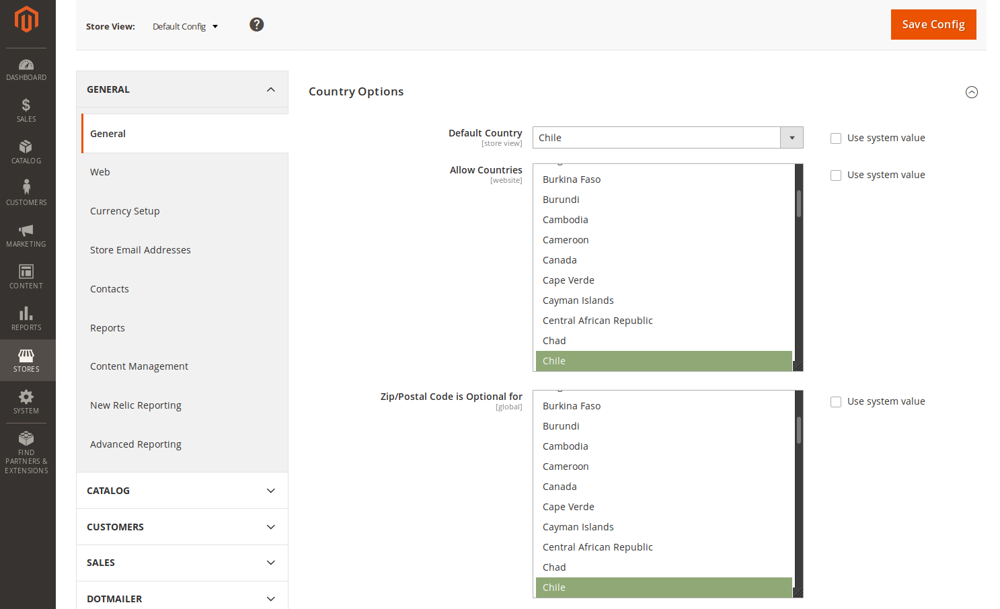
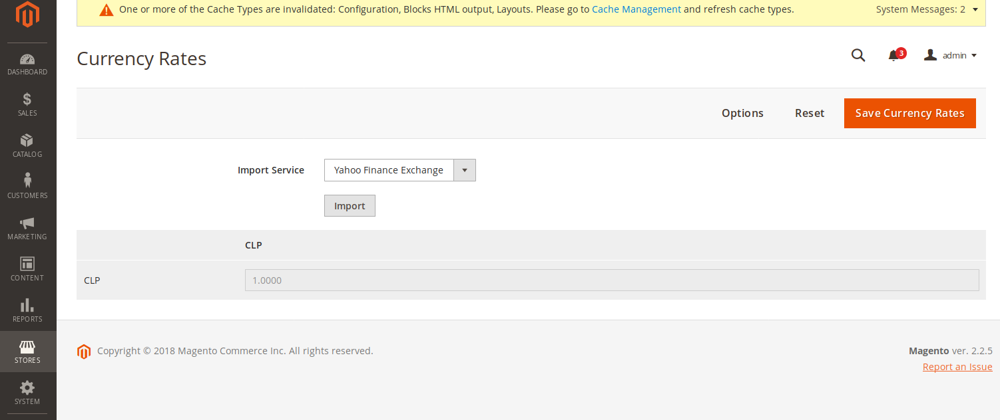
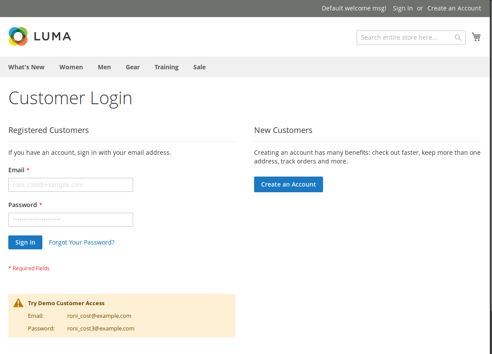
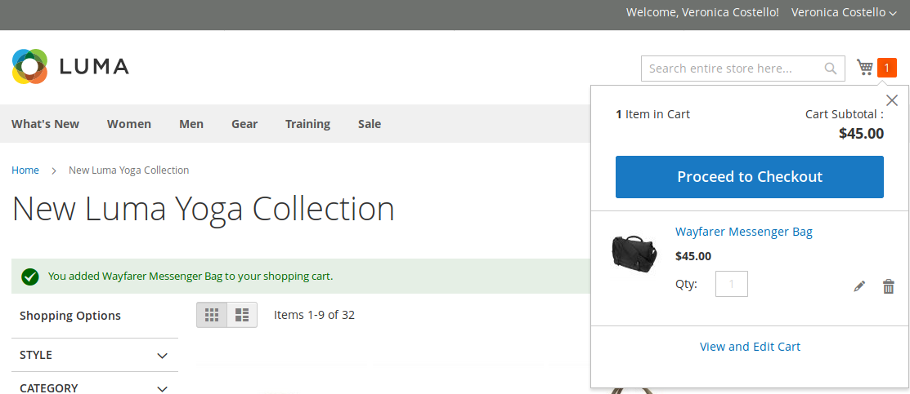
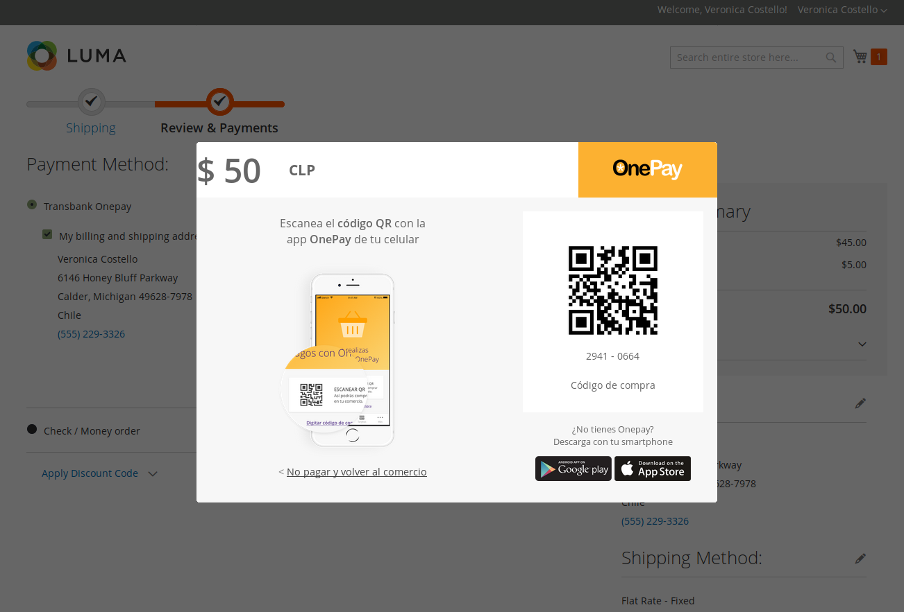
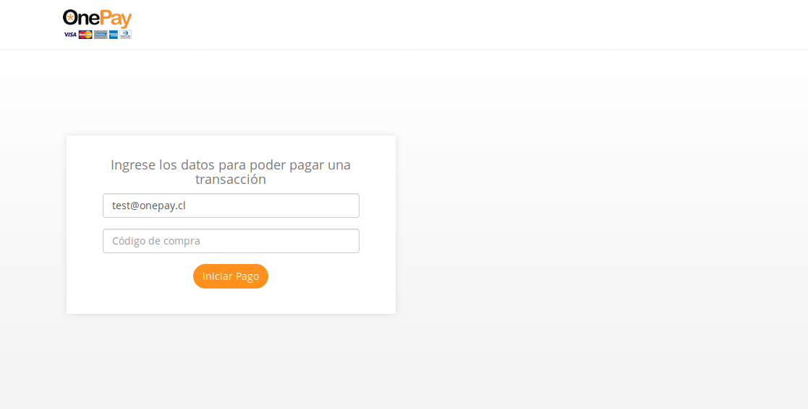
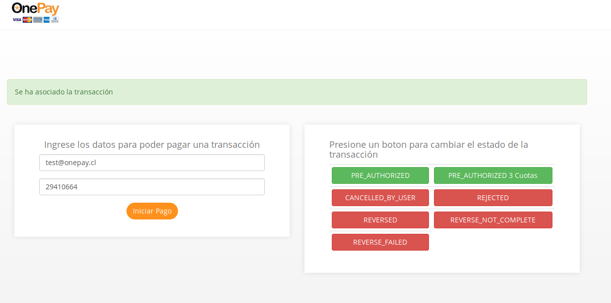
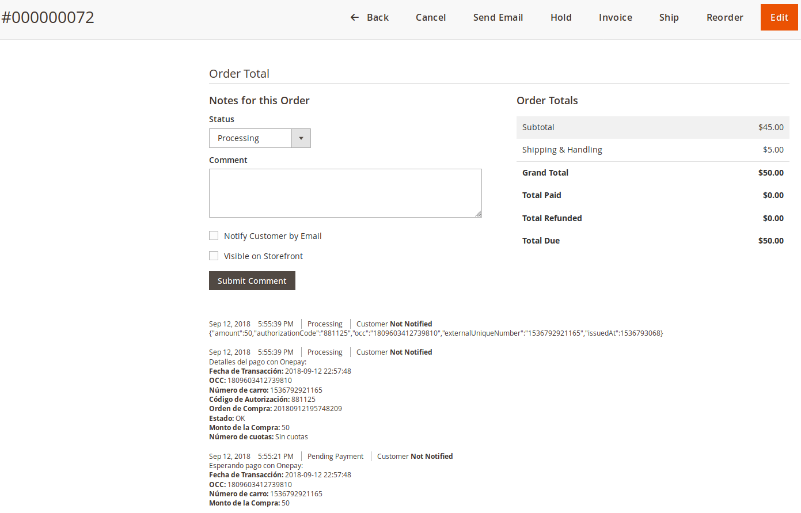

# Manual de instalación para Plugin Magento2

## Descripción

Este plugin oficial ha sido creado para que puedas integrar Onepay fácilmente en tu comercio, basado en Magento2.

## Requisitos

1. Debes tener instalado previamente Magento2
2. Tus credenciales de Magento Market a mano. Si no sabes cuales son tus credenciales puedes revisar esta guia: [https://devdocs.magento.com/guides/v2.2/install-gde/prereq/connect-auth.html](https://devdocs.magento.com/guides/v2.2/install-gde/prereq/connect-auth.html)

## Instalación del Plugin

1. Dirígete a [https://github.com/TransbankDevelopers/transbank-plugin-magento2-onepay](https://github.com/TransbankDevelopers/transbank-plugin-magento2-onepay) para ver el repositorio del plugin.

  En tu directorio de Magento2, ejecutar el comando:

    composer require transbank/onepay-magento2

  

  Cuando finalice, ejecutar el comando:

    magento module:enable Transbank_Onepay --clear-static-content

  

  Cuando finalice, ejecutar el comando:

    magento setup:upgrade && magento setup:di:compile && magento setup:static-content:deploy

  
  
2. Una vez realizado el proceso anterior, Magento2 debe haber instalado el plugin Onepay. Cuando finalice, debes activar el plugin en el administrador de Magento2.

## Configuración

Este plugin posee un sitio de configuración que te permitirá ingresar credenciales que Transbank te otorgará y además podrás generar un documento de diagnóstico en caso que Transbank te lo pida.

Para acceder a la configuración, debes seguir los siguientes pasos:

1. Dirígete a la página de administración de Magento2 (usualmente en http://misitio.com/admin, http://localhost/admin) e ingresa usuario y clave.

  
  
2. Dentro del sitio de administración dirígete a (Stores / Configuration).

  

3. Luego a sección (Sales / Payments Methods).

  

4. Elegir el país Chile

  

5. Bajando al listado de métodos de pagos verás Onepay

  

6. ¡Ya está! Estás en la pantalla de configuración del plugin, debes ingresar la siguiente información:
  * **Enable**: Al activarlo, Onepay estará disponible como medio de pago. Ten la precaución de que se encuentre marcada esta opción cuando quieras que los usuarios paguen con Onepay.
  * **Endpoint**: Ambiente hacia donde se realiza la transacción. 
  * **APIKey**: Es lo que te identifica como comercio.
  * **Shared Secret**: Llave secreta que te autoriza y valida a hacer transacciones.
  
  Las opciones disponibles para _Endpoint_ son: "Integración" para realizar pruebas y certificar la instalación con Transbank, y "Producción" para hacer transacciones reales una vez que Transbank ha aprobado el comercio. Dependiendo de cual Endpoint se ha seleccionado el plugin usará uno de los dos set de APIKey y Shared Secret según corresponda. 
  
### Credenciales de Prueba

Para el ambiente de Integración, puedes utilizar las siguientes credenciales para realizar pruebas:

* APIKey: `dKVhq1WGt_XapIYirTXNyUKoWTDFfxaEV63-O5jcsdw`
* Shared Secret: `?XW#WOLG##FBAGEAYSNQ5APD#JF@$AYZ`

7. Guardar los cambios presionando el botón [Save Config]

  

8. Además, puedes generar un documento de diagnóstico en caso que Transbank te lo pida. Para ello, haz click en "Generar PDF de Diagnóstico", y automáticamente se descargará dicho documento.

  

## Configuración de magento2 para Chile CLP

El plugin solamente funciona con moneda chilena CLP dado esto magento2 debe estar correctamente configurado para que que se pueda usar Onepay.

1. Ir a la sección de administración (Stores / General / Country Option) y elegir Chile tal como se muestra en la siguiente imagen, luego guardar los cambios.

  

2. Ir a la sección de administración (Stores / Currency Setup / Country Option) y elegir Chile tal como se muestra en la siguiente imagen, luego guardar los cambios.

  

3. Ir a la sección de administración (Stores / Currency) y verificar en las dos secciones (Currency Rates y Currency Symbols) que CLP se encuentre activo.

  

  

  

## Prueba de instalación con transacción

En ambiente de integración es posible realizar una prueba de transacción utilizando un emulador de pagos online.

* Ingresa al comercio

  

* Ya con la sesión iniciada, ingresa a cualquier sección para agregar productos

  

* Agrega al carro de compras un producto:

  

* Selecciona el carro de compras y luego presiona el botón [Proceed to Checkout]:

  

* Selecciona método de envío y presiona el botón [Next]
  
  Debes asegurarte que tu dirección de envio sea en Chile.

  

* Selecciona método de pago Transbank Onepay, luego presiona el botón [Place Order]

  

* Una vez presionado el botón para iniciar la compra, se mostrará la ventana de pago Onepay, tal como se ve en la imagen. Toma nota del número que aparece como "Código de compra", ya que lo necesitarás para emular el pago en el siguiente paso:
  
  
  
* En otra ventana del navegador, ingresa al emulador de pagos desde [https://onepay.ionix.cl/mobile-payment-emulator/](https://onepay.ionix.cl/mobile-payment-emulator/), utiliza test@onepay.cl como correo electrónico, y el código de compra obtenido desde la pantalla anterior. Una vez ingresado los datos solicitados, presiona el botón "Iniciar Pago":
* 
  
  
* Si todo va bien, el emulador mostrará opciones para simular situaciones distintas. Para simular un pago exitoso, presiona el botón `PRE_AUTHORIZED`. En caso de querer simular un pago fallido, presiona le botón `REJECTED`. Simularemos un pago exitóso presionando el botón `PRE_AUTHORIZED`.

  
  
* Vuelve a la ventana del navegador donde se encuentra Magento2 y podrás comprobar que el pago ha sido exitoso.

 

* Además si accedes al sitio de administración seccion (Sales / Ordes) se podrá ver la orden creada y el detalle de los datos entregados por Onepay.

 

 

 
